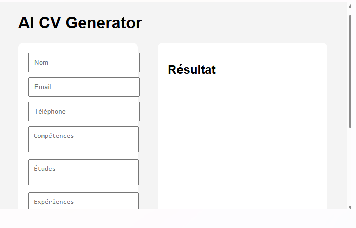
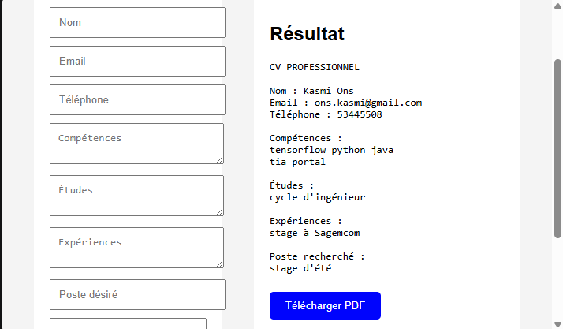
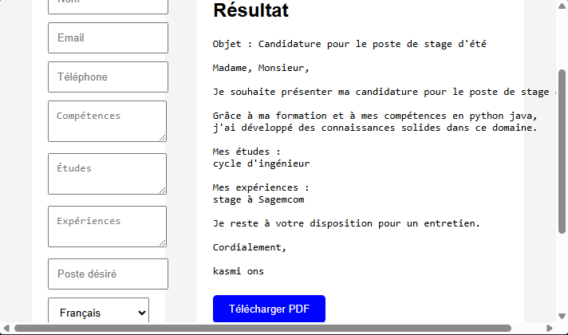
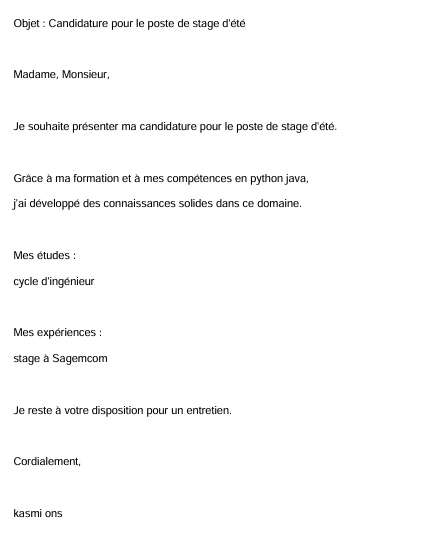

# AI CV Generator

Application web développée avec Flask permettant de générer automatiquement un CV ou une lettre de motivation à partir des informations saisies par l'utilisateur.

## Réalisé par

* Kasmi Ons
* Nom du binôme (si applicable)

## Fonctionnalités

* Génération automatique de CV
* Génération automatique de lettre de motivation
* Choix de la langue (Français / Anglais)
* Exportation au format PDF
* Interface web simple et intuitive

## Technologies utilisées

* Python
* Flask
* HTML/CSS
* FPDF

## Structure du projet

cv_generator_ai/

├── app.py

├── requirements.txt

├── README.md

├── templates/

│   └── index.html

├── generated/

│   └── cv.pdf

└── screenshots/

    ├── accueil.png

    ├── cv.png

    ├── lettre.png

    └── pdf.png

## Installation

Installer les dépendances :

pip install -r requirements.txt

## Exécution

Lancer l'application :

python app.py

Puis ouvrir dans le navigateur :

http://127.0.0.1:5000

## Captures d'écran

### Interface principale

### Génération du CV

### Génération de la lettre de motivation

### PDF généré

## Auteur

Kasmi Ons
